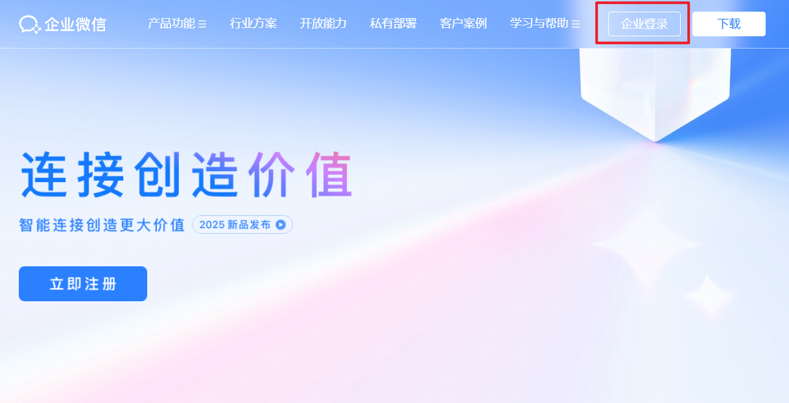
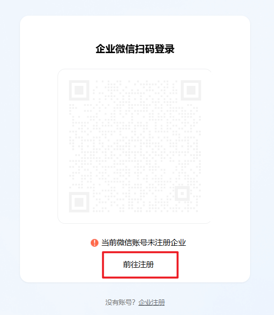
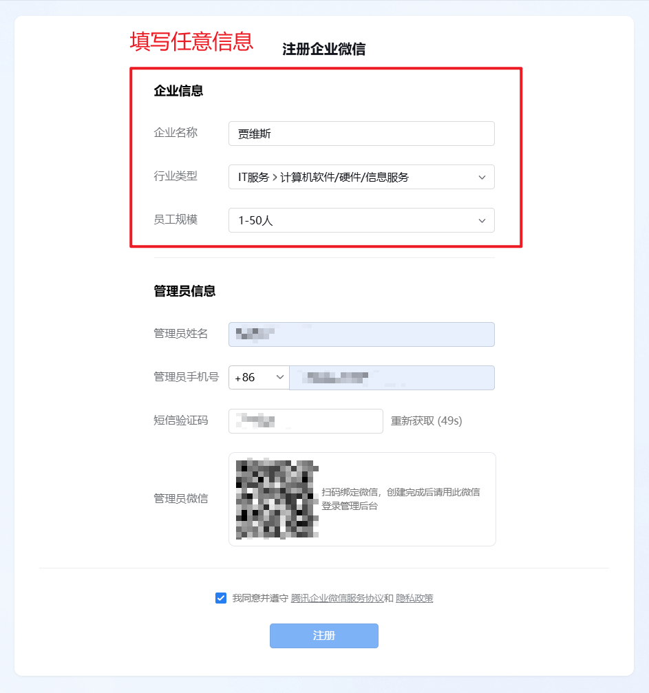
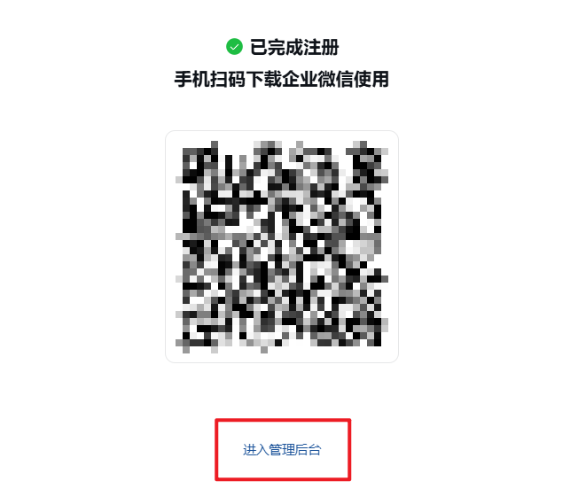
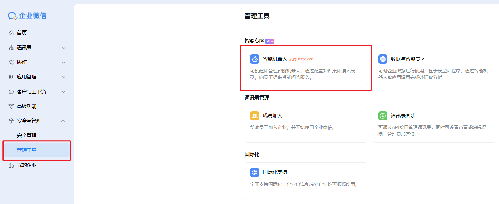
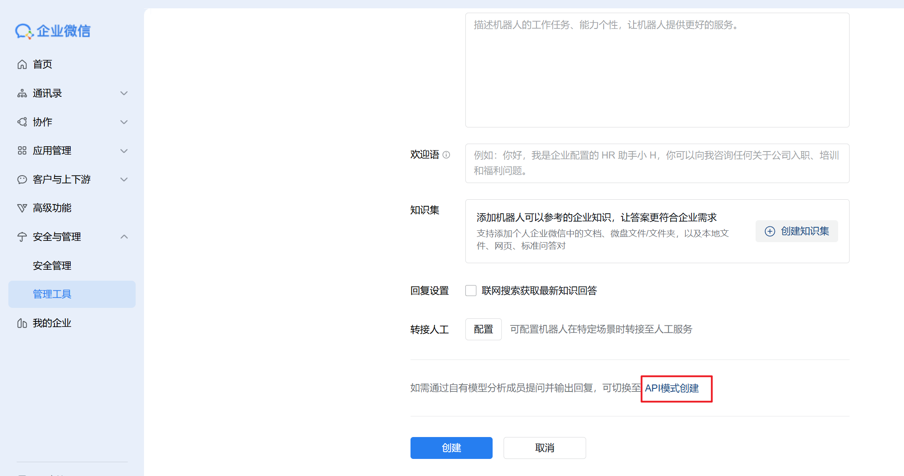
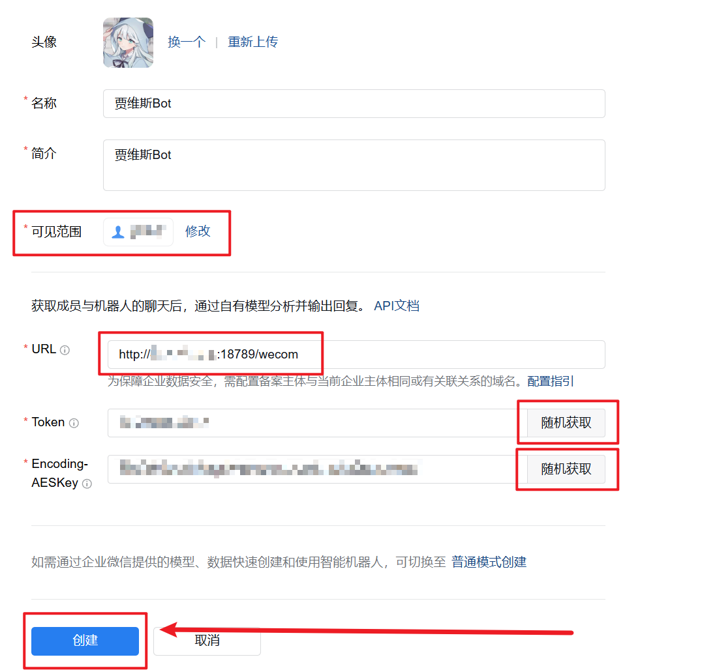
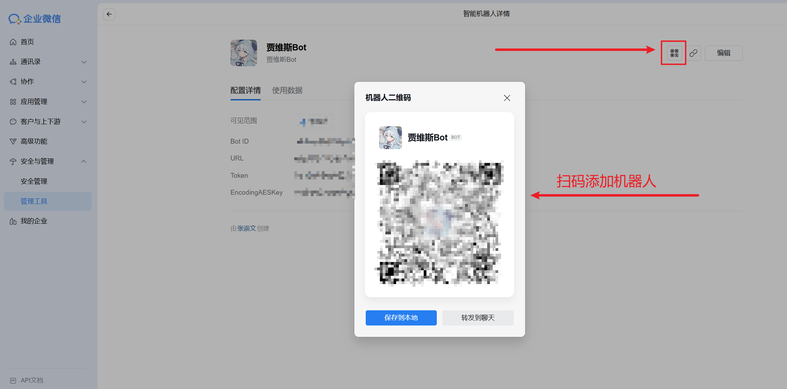

# 企业微信（智能机器人）渠道配置指南

<div align="center">

  <p>
    <strong>⭐ 如果这个项目对你有帮助，请给我们一个Star！⭐</strong><br>
    <em>您的支持是我们持续改进的动力</em>
  </p>
</div>

本文档用于配置 OpenClaw China 的企业微信智能机器人渠道（`wecom`）。

仓库地址：<https://github.com/BytePioneer-AI/openclaw-china>


## 一、在企业微信后台创建智能机器人

### 1. 注册并登录企业微信

访问 <https://work.weixin.qq.com/>，按页面提示注册并进入管理后台。






### 2. 创建智能机器人并填写回调





创建时需要填写回调地址：

`http://<你的IP或域名>:18789/wecom`

注意事项：

1. 服务器 `18789` 端口需要可访问。
2. 先记录平台生成的 `Token` 和 `EncodingAESKey`。
3. 若“创建”时报回调校验失败，通常是网关未启动或地址不可达。并且需确保先完成下面的安装和启动，再回到后台确认。


## 二、安装 OpenClaw 与插件

### 1. 安装 OpenClaw

```bash
npm install -g openclaw@latest
```

### 2. 初始化网关

```bash
openclaw onboard --install-daemon
```

按向导完成基础初始化即可，渠道配置后面再补。

### 3. 安装渠道插件

**方式一：安装聚合包（推荐）**

```bash
openclaw plugins install @openclaw-china/channels
```
仅安装企业微信渠道

```bash
openclaw plugins install @openclaw-china/wecom
```

**方式二：从源码安装，全平台通用**

⚠️ Windows 用户注意：由于 OpenClaw 存在 Windows 兼容性问题（spawn npm ENOENT），npm 安装方式暂不可用，请使用方式二。

```bash
git clone https://github.com/BytePioneer-AI/openclaw-china.git
cd openclaw-china
pnpm install
pnpm build
openclaw plugins install -l ./packages/channels
```


## 三、配置

最小可用配置：

```bash
openclaw config set channels.wecom.enabled true
openclaw config set channels.wecom.webhookPath /wecom
openclaw config set channels.wecom.token your-token
openclaw config set channels.wecom.encodingAESKey your-43-char-encoding-aes-key
openclaw config set gateway.bind lan
```

也可以直接编辑 `~/.openclaw/openclaw.json`：

```json
{
  "channels": {
    "wecom": {
      "enabled": true,
      "webhookPath": "/wecom",
      "token": "your-token",
      "encodingAESKey": "your-43-char-encoding-aes-key"
    }
  }
}
```

可选策略项（按需）：

- `dmPolicy`: `open | pairing | allowlist | disabled`
- `allowFrom`: 私聊白名单
- `groupPolicy`: `open | allowlist | disabled`
- `groupAllowFrom`: 群聊白名单
- `requireMention`: 群聊是否要求 @ 机器人

## 四、启动并验证

调试启动（推荐先用）：

```bash
openclaw gateway --port 18789 --verbose
```

或后台启动：

```bash
openclaw daemon start
```


## 五、创建机器人

**点击 创建**



创建完毕后扫码添加机器人，即可开启聊天。


